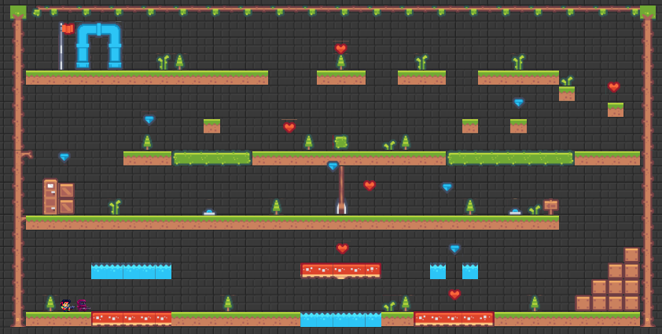
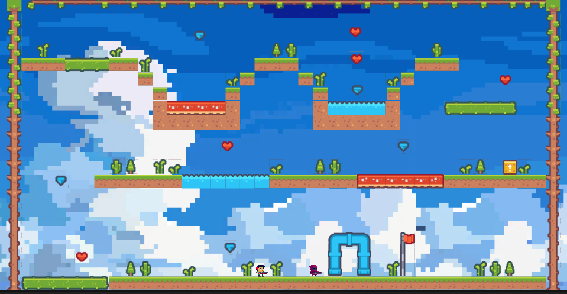
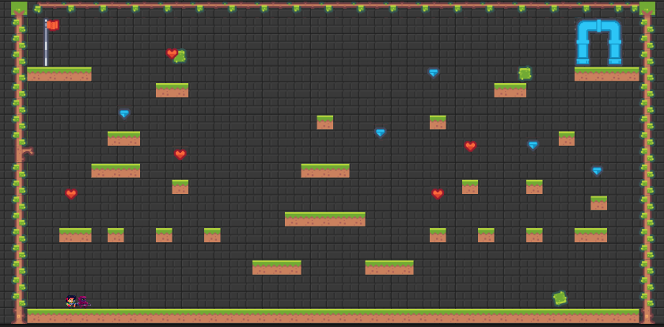

# Trabajo final de Intro. al Desarrollo de Videojuegos: Fireboy and WaterGirl: The Mario's temple

¡Bienvenido al repositorio de Fireboy and WaterGirl: The Mario's temple! Este es un juego recreado en Unity, inspirado en el clásico juego de Fireboy and WaterGirl, pero con un emocionante giro: ¡el diseño de las escenas y las animaciones están basadas en el mundo de Mario Bros!

## Acerca del Juego

Fireboy and WaterGirl: El Templo de Mario es un divertido juego de plataformas y puzzle en el que controlarás a dos personajes, Fireboy (reencarnado en un soldado) y WaterGirl (reencarnado en thanos), en su misión para explorar un misterioso templo lleno de desafiantes niveles. Cada personaje tiene habilidades especiales: Fireboy puede pasar por el fuego sin problemas, mientras que WaterGirl puede atravesar el agua sin dificultad. Juntos, deberán superar obstáculos, evitar trampas y resolver puzzles para alcanzar la salida de cada nivel.

## Características

- **Dos personajes jugables:** Controla a Fireboy y WaterGirl, alternando entre ellos para aprovechar sus habilidades únicas.
- **Diseño basado en Mario Bros:** Inspirado en el mundo de Mario Bros, con escenas y animaciones inspiradas en el juego.
- **Niveles desafiantes:** Hay 3 niveles cada uno con particularidades.
- **Modo de un jugador y cooperativo:** Juega solo controlando a ambos personajes o invita a un amigo para disfrutar del modo cooperativo y superar los desafíos juntos.
- **Sistema de puntuación:** Intenta completar cada nivel en el menor tiempo posible, recolectando la mayor cantidad de diamantes/corazones y muriendo la menor cantidad de veces. Los ranking son: A1, A2, B1, B2, C1, C2. En donde A1 es pasar un nivel excelente y C2 es que no hiciste es pero nada!
- **Gráficos y sonidos atractivos:** Disfruta de un ambiente visual y sonoro divertido (ya lo verás) que te sumergirá en la experiencia del juego.

## Capturas del juego
### Escenario 1

### Escenario 2

### Escenario 3

## Link para jugar

[FireBoy and WaterGirl](https://jeancomontoyac.itch.io/trabajo-final-videojuegos)

## Video del gameplay

[Video gameplay](https://drive.google.com/file/d/1y6jBsilYQo3IvyIaCYrRg_UGvE84E7EK/view?usp=sharing)

## Anotaciones
- Se recomienda jugar en el navegador Google Chrome.
- Versión de Unity: 2021.3.17f1

